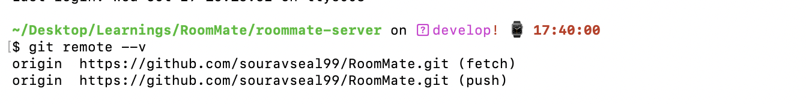

# 🤝 Contributing to RoomMate – Shared Living App

Thank you to all the contributors of **RoomMate** 🎉 , small changes are the most impactfull changes 🚀

We welcome contributions of all kinds: bug reports, feature requests, documentation improvements, or code changes.

Always remember guys, communication is the heart of a community, and open source is all about community. So please feel free to tag us whenenver something slows you down, we'll be more than happy to help.

---

<!-- ## 📝 Code of Conduct

Please be respectful and constructive. By participating, you agree to uphold our [Code of Conduct](CODE_OF_CONDUCT.md) (if added later).

--- -->

## 🚀 Getting Started

### 1. Fork & Clone

```bash
git clone https://github.com/YOUR-USERNAME/RoomMate.git
cd roommate
git remote add origin </LINK TO YOUR FORKED REPO/>
git remote add upstream https://github.com/souravseal99/RoomMate.git

```

check if your origin and upstream is properly set -

```bash
git remote --v
```

you will see something like this (**NOTE:** As I only have set the origin here, I can only see the origin link but if I had my upstream setup that would be also reflected here) -



### 2. Setup Backend

#### Setup DB:

There are 3 options to setup the DB

- [create a postgres server](https://www.prisma.io/docs/orm/more/help-and-troubleshooting/dataguide/setting-up-a-local-postgresql-database)
- [create a docker instance of postgres](https://www.docker.com/blog/how-to-use-the-postgres-docker-official-image/)
- [neon db - a cloud based db offered by vercel](https://neon.com/)

Connect the DB to the backend by modifying the DB related fields in the .env file -

```
DATABASE_URL = Your database url
```

Make the Backend up and running -

```bash
cd roommate-server
cp .env.example .env
npm install
npx run db:migrate
npm run dev
```

### 3. Setup Frontend

```bash
cd roommate-app
cp .env.example .env
npm install
npm run dev
```

#### **NOTE:** Roommate follows mobile first development approach, to simply put, the UI should look good on a mobile device.

---

## 📂 Project Structure

See [README.md](./ReadMe.md) for the full structure. In short:

- `roommate-app/` → React + Vite + Tailwind + shadcn/ui
- `roommate-server/` → Express + Prisma + PostgreSQL

---

## 🛠️ Contribution Workflow

1. **Create an Issue**

   - Check if the issue already exists.
   - If not, open a new issue describing the bug or feature.
   - drop a note asking to contribute on the issue (before you start working)

2. **Pull the latest develop Branch**

   ```bash
   git pull upstream develop
   ```

3. **Work on a Branch created from the latest develop branch**

   ```bash
   git checkout -b feature-(ISSUE_NO)/your-feature
   ```

4. **Write Clean Code**

   - Use TypeScript types/interfaces.
   - Follow existing folder conventions (`api`, `services`, `pages`, etc.).
   - Keep components small and reusable. Modularity is a must have.

5. **Commit Messages**
   Follow a consistent style:

   ```
   feat: add new household creation form
   fix: resolve expense deletion state issue
   docs: improve README with setup instructions
   ```

6. **Push & Create PR**

   ```bash
   git push origin feature-(ISSUE_NO)/your-feature
   ```

   Open a Pull Request against the `develop` branch.

---

## ✅ Pull Request Guidelines

- Link the issue number (e.g., `Closes #42`).
- Keep PRs small and focused.
- Add screenshots if you changed UI.
- Ensure `npm run lint` and tests (if added later) pass.

---

## 🎯 Areas You Can Contribute

- **Frontend**: UI components, routing, state management, API integration.
- **Backend**: Routes, services, validation, Prisma models.
- **Docs**: Improve setup instructions, add examples, clarify workflows.
- **Tests**: Unit tests & integration tests (coming soon).

---

## ❄️ Winter of Code Social Notes

- We label beginner-friendly issues with **`good first issue`**.
- Feel free to pick any open issue or suggest new ideas.
- First-time contributors are especially welcome ❤️
- Issues will be assigned based on the FCFS (First Come First Serve) principle
- Based on the difficulty level issues will be tagged as level-1, level-2 & level-3 issues
- Based on the work done, PRs will also be tagged as the same
- Each level has points assigned to it, which will help the contributor to climb the leaderboard.

---

## 📜 License

By contributing, you agree that your contributions will be licensed under the [MIT License](LICENSE).
